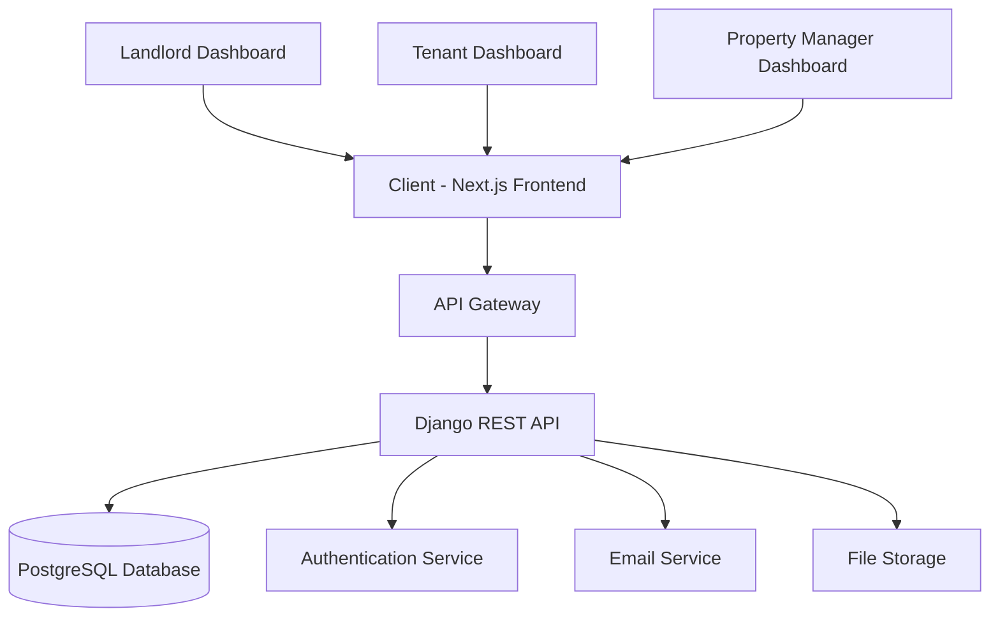

# Edo Real Estate Management Platform

Edo is a comprehensive SaaS platform for real estate management that connects landlords, tenants, and property managers in a seamless digital ecosystem. The platform provides tools for property listing, tenant management, maintenance tracking, payment processing, and communication.

## Table of Contents

- [Project Overview](#project-overview)
- [Key Features](#key-features)
- [Technology Stack](#technology-stack)
- [Architecture](#architecture)
- [Project Structure](#project-structure)
- [Getting Started](#getting-started)
  - [Prerequisites](#prerequisites)
  - [Installation](#installation)
  - [Running the Application](#running-the-application)
- [Development](#development)
- [API Documentation](#api-documentation)
- [Deployment](#deployment)
- [Contributing](#contributing)
- [License](#license)

## Project Overview

Edo is designed to streamline property management by providing separate dashboards and functionalities for different user roles:

- **Landlords**: Manage properties, units, tenants, track payments, handle maintenance requests
- **Tenants**: Pay rent, submit maintenance requests, communicate with landlords
- **Property Managers**: Oversee multiple properties and coordinate between landlords and tenants

The platform features a modern, responsive UI built with Next.js and a robust backend powered by Django REST Framework.

## Key Features

### For Landlords

- Property and unit management
- Tenant onboarding and management
- Rent collection and payment tracking
- Maintenance request handling
- Communication tools
- Financial reporting and analytics

### For Tenants

- Property browsing and searching
- Rent payment processing
- Maintenance request submission
- Notice board for announcements
- Communication with landlords

### For Property Managers

- Multi-property portfolio management
- Comprehensive reporting dashboard
- Tenant and landlord coordination
- Maintenance workflow management

## Technology Stack

### Frontend

- **Next.js 15** - React framework for production
- **React 19** - UI library
- **Tailwind CSS** - Utility-first CSS framework
- **TanStack Query** - Server state management
- **Lucide React** - Icon library

### Backend

- **Django 4+** - High-level Python web framework
- **Django REST Framework** - Powerful toolkit for building Web APIs
- **PostgreSQL** - Object-relational database system
- **JWT Authentication** - Secure token-based authentication

### DevOps

- **Docker** - Containerization platform
- **Vercel** - Frontend deployment
- **Heroku/AWS** - Backend deployment options

## Architecture



## Project Structure

```
edo/
├── backend/                 # Django backend
│   ├── edo/                # Django project settings
│   ├── edoAPI/             # Main API application
│   │   ├── models.py       # Data models
│   │   ├── views.py        # API views
│   │   ├── serializers.py  # Data serialization
│   │   └── urls.py         # API routing
│   └── manage.py           # Django CLI utility
├── edo/                    # Next.js frontend
│   ├── src/
│   │   ├── app/            # Next.js app directory
│   │   │   ├── landlord/   # Landlord dashboard
│   │   │   ├── tenant/     # Tenant dashboard
│   │   │   └── ...         # Other pages
│   │   ├── components/     # Reusable UI components
│   │   ├── contexts/       # React context providers
│   │   ├── utils/          # Utility functions
│   │   └── partials/       # Layout components
│   ├── public/             # Static assets
│   └── ...
├── README.md
└── ...
```

### Frontend Structure

- **app/** - Next.js 13+ app directory with role-based routing
- **components/** - Shared and role-specific components
- **contexts/** - React context for state management
- **utils/** - Helper functions and API clients
- **partials/** - Layout and navigation components

### Backend Structure

- **edo/** - Django project configuration
- **edoAPI/** - Main application with all business logic
  - **models.py** - Database schema and relationships
  - **views.py** - API endpoints and business logic
  - **serializers.py** - Data validation and serialization
  - **urls.py** - API route definitions

## Getting Started

### Prerequisites

- Node.js 18+
- Python 3.8+
- PostgreSQL 12+
- npm or yarn

### Installation

1. **Clone the repository:**

   ```bash
   git clone <repository-url>
   cd edo
   ```

2. **Frontend setup:**

   ```bash
   cd edo
   npm install
   ```

3. **Backend setup:**

   ```bash
   cd ../backend
   pip install -r requirements.txt
   ```

4. **Database setup:**
   ```bash
   python manage.py migrate
   python manage.py loaddata initial_data.json  # if available
   ```

### Running the Application

1. **Start the backend server:**

   ```bash
   cd backend
   python manage.py runserver
   ```

2. **Start the frontend development server:**

   ```bash
   cd edo
   npm run dev
   ```

3. **Access the application:**
   - Frontend: http://localhost:3000
   - Backend API: http://localhost:8000

## Development

### Frontend Development

The frontend follows Next.js 13+ app directory structure with:

- Server-side rendering capabilities
- Role-based layouts and components
- Tailwind CSS for styling
- TanStack Query for server state management

### Backend Development

The backend uses Django REST Framework with:

- Custom user model with role-based permissions
- Comprehensive property and tenant management models
- JWT-based authentication
- RESTful API design

## API Documentation

API documentation is available through:

1. Django REST Framework browsable API at `/api/`
2. Swagger/OpenAPI documentation (if implemented)
3. Postman collection (if available)

## Deployment

### Frontend Deployment

Deploy to Vercel:

```bash
npm run build
# Deploy using Vercel CLI or GitHub integration
```

### Backend Deployment

Deploy to Heroku or AWS:

```bash
# Set environment variables
# Run migrations
python manage.py migrate
# Start server
gunicorn edo.wsgi:application
```

## Contributing

1. Fork the repository
2. Create your feature branch (`git checkout -b feature/AmazingFeature`)
3. Commit your changes (`git commit -m 'Add some AmazingFeature'`)
4. Push to the branch (`git push origin feature/AmazingFeature`)
5. Open a pull request

## License

This project is licensed under the MIT License - see the [LICENSE](LICENSE) file for details.
